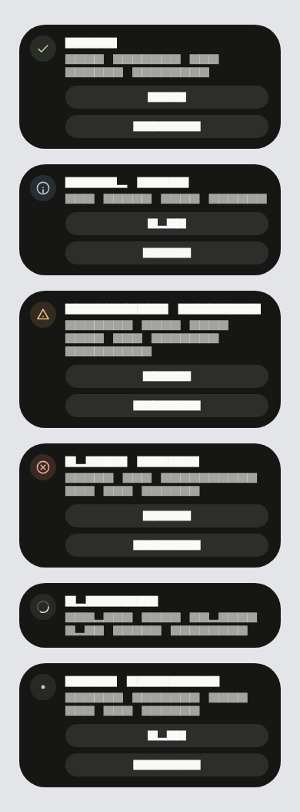

# capsule_toast

Brand-neutral morphing capsule notifications for Flutter.



## Features

- Top-center morphing capsule with interruptible spring motion
- Structured semantic factories: success, information, warning, error, loading,
  neutral, and custom
- Explicit FIFO queueing with replace and clear-and-show policies
- Live handle commands: expand, collapse, resolve, dismiss
- Loading toast resolution that preserves the same handle
- Visual and motion themes via `ThemeExtension` and `CapsuleToastTheme`
- Custom content builders with optional `CapsuleToastAnimatedSlot` reveals
- Touch, mouse, keyboard, RTL, text scale, safe area, and reduced-motion support
- Nested hosts with independent queues (no global singleton)

## Installation

```yaml
dependencies:
  capsule_toast: ^0.3.0
```

```bash
flutter pub get
```

## Setup

Install the host once through `MaterialApp.builder`. Lookup always goes through
`CapsuleToastHost.of(context)` — there is no global manager, navigator key, or
`BuildContext` extension.

```dart
import 'package:capsule_toast/capsule_toast.dart';
import 'package:flutter/material.dart';

class MyApp extends StatelessWidget {
  const MyApp({super.key});

  @override
  Widget build(BuildContext context) {
    return MaterialApp(
      builder: (BuildContext context, Widget? child) {
        return CapsuleToastHost(child: child!);
      },
      home: const HomePage(),
    );
  }
}
```

## Showing toasts

```dart
import 'package:capsule_toast/capsule_toast.dart';
import 'package:flutter/material.dart';

void onSaved(BuildContext context) {
  CapsuleToastHost.of(context).show(
    CapsuleToastData.success(title: 'Saved'),
  );
}
```

Other factories: `information`, `warning`, `error`, `loading`, `neutral`, and
`custom`. Pass `initialMode: CapsuleToastMode.expanded` to open expanded.

## Queue policy

By default, a new toast replaces the active capsule. Pass
`CapsuleToastQueuePolicy.enqueue` explicitly when events must wait in FIFO
order.

```dart
final CapsuleToastManager manager = CapsuleToastHost.of(context);

manager.show(
  CapsuleToastData.information(title: 'Queued'),
  queuePolicy: CapsuleToastQueuePolicy.enqueue,
);

manager.show(
  CapsuleToastData.warning(title: 'Replaces active'),
  queuePolicy: CapsuleToastQueuePolicy.replace,
);

manager.show(
  CapsuleToastData.error(title: 'Clears queue first'),
  queuePolicy: CapsuleToastQueuePolicy.clearAndShow,
);

manager.clear();
```

`CapsuleToastHost(maximumQueueLength: …)` caps queued records behind the active
toast. Overflowing enqueues complete with
`CapsuleToastDismissReason.queueOverflow`.

## Handle commands

`show` returns a `CapsuleToastHandle` for the live record:

```dart
final CapsuleToastHandle handle = CapsuleToastHost.of(context).show(
  CapsuleToastData.information(title: 'Details available'),
);

handle.expand();
handle.collapse();
handle.dismiss();

final CapsuleToastResult result = await handle.closed;
```

## Loading resolution

Resolve a loading toast into a terminal toast without creating a second record:

```dart
final CapsuleToastHandle handle = CapsuleToastHost.of(context).show(
  CapsuleToastData.loading(title: 'Uploading'),
);

// later…
handle.resolve(CapsuleToastData.success(title: 'Uploaded'));
```

## Actions

```dart
CapsuleToastHost.of(context).show(
  CapsuleToastData.information(
    title: 'Draft ready',
    compactAction: CapsuleToastAction(
      label: 'Open',
      onPressed: () {
        // navigate…
      },
    ),
    primaryAction: CapsuleToastAction(
      label: 'Review',
      onPressed: () {},
    ),
    secondaryAction: CapsuleToastAction(
      label: 'Dismiss',
      onPressed: () {},
      dismissOnInvoke: true,
    ),
  ),
);
```

## Visual theme

Provide overrides with `CapsuleToastTheme`, `ThemeData.extensions`, or per-toast
`theme:` on `CapsuleToastData`.

```dart
CapsuleToastTheme(
  data: CapsuleToastThemeData.fallback().copyWith(
    surfaceColor: const Color(0xFF1E293B),
    foregroundColor: const Color(0xFFF8FAFC),
  ),
  child: child,
);
```

Fonts inherit from the application — this package does not bundle typefaces.

## Motion theme

```dart
CapsuleToastTheme(
  data: CapsuleToastThemeData.fallback(),
  motionTheme: CapsuleToastMotionTheme.fallback().copyWith(
    reducedMotionPolicy: CapsuleToastReducedMotionPolicy.system,
    hapticPolicy: CapsuleToastHapticPolicy.supportedPlatforms,
  ),
  child: child,
);
```

## Custom builders and animated slots

```dart
CapsuleToastHost.of(context).show(
  CapsuleToastData.custom(
    title: 'Custom capsule',
    compactBuilder: (BuildContext context, CapsuleToastContentContext details) {
      return CapsuleToastAnimatedSlot(
        slot: CapsuleToastSlot.title,
        child: Text(details.toast.title ?? ''),
      );
    },
    expandedBuilder: (BuildContext context, CapsuleToastContentContext details) {
      return Column(
        mainAxisSize: MainAxisSize.min,
        children: <Widget>[
          CapsuleToastAnimatedSlot(
            slot: CapsuleToastSlot.title,
            child: Text(details.toast.title ?? ''),
          ),
          CapsuleToastAnimatedSlot(
            slot: CapsuleToastSlot.message,
            child: const Text('Expanded custom body'),
          ),
        ],
      );
    },
  ),
);
```

## Nested hosts

Each `CapsuleToastHost` owns its queue, handles, clocks, and ticker. Nest hosts
when a subtree needs an independent toast layer. Prefer one host near the app
root for most applications.

## Accessibility

- Semantic announcements for structured and custom content
- Keyboard dismissal and action activation where applicable
- RTL mirroring for travel and layout
- Respects `MediaQuery.disableAnimations` / reduced-motion policy
- Large text scale and safe-area insets

## Platform support

Android, iOS, web, Windows, macOS, and Linux. iOS and Android are the pixel and
motion fidelity targets.

## Performance behavior

One top-center capsule renders per host. Geometry uses deterministic
bounded-step springs that preserve position and velocity when targets change.
Hold timing pauses while the user interacts. Prefer short titles and avoid
heavy work inside content builders.

## API reference

Public entry point: `package:capsule_toast/capsule_toast.dart`.

| Type | Role |
|------|------|
| `CapsuleToastHost` | Application-owned host and lookup |
| `CapsuleToastManager` | `show` / `clear` / `queueLength` |
| `CapsuleToastData` | Toast configuration factories |
| `CapsuleToastHandle` | Live expand / collapse / resolve / dismiss |
| `CapsuleToastResult` | Completion reason and optional action |
| `CapsuleToastAction` | Tappable action description |
| `CapsuleToastTheme` / `CapsuleToastThemeData` | Visual theming |
| `CapsuleToastMotionTheme` / `CapsuleToastSpring` | Motion theming |
| `CapsuleToastAnimatedSlot` | Staggered custom content reveals |
| Enums in `CapsuleToastType`, `Mode`, `QueuePolicy`, and related types | Semantics and policy |

See the `example/` directory for an interactive lab that tours the API.

## License

BSD 3-Clause. Copyright 2026 The Capsule Toast Authors.
